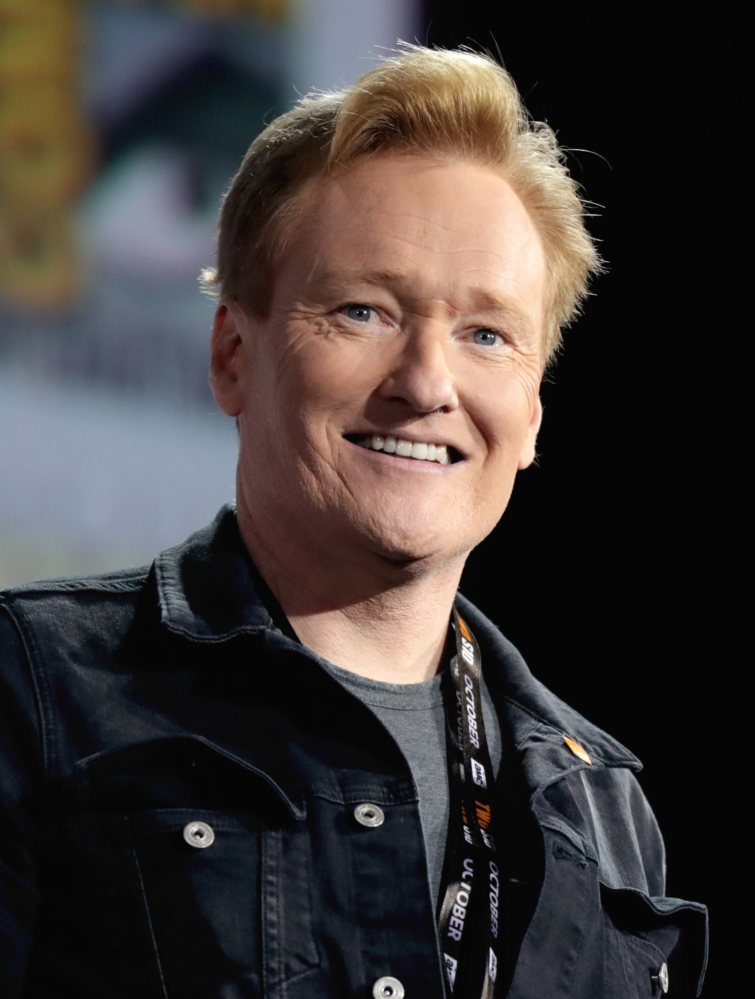

# DATA 310 MACHINE LEARNING - 07/15/2020

# A

### 1.) 
#### The ImageDataGenerator() accepts the original data, raondomly transforms it, and then returns only the new, transformed data. Also, the generator is coded to read images from subdirectories, and automatically label them from the name of that subdirectory. Essentially you will have a training directory for 'horses' and directory for humans. Then the generator will label the images appropriately for you, reducing a coding step. In order to flow from the directory to the generated object, you will need to import a set of images for the generator to scan, a list of training images and labels in order to compare against your test images, and a rescaler of your images to match the training data. In regards to the target size, it is listed in the code as (300,300). In relation to your testing data images, you are running those through your generator and will be resized to 150x150. So whether your images are 500x500, 1080x1080, or larger, they will be resized when running through this generator. In reference to the class mode, I would be sure to reference whether we are using binary_crossentropy loss or not. If we are not using that type of crossentropy then we need to accomodate to what type we do need within the generator itself. When first running this model, gave the generator the image of Conan O'Brien who is my favorite comedian and was told that he looked similar to a horse. I feel like he would have gotten a laugh out of that.

### 2.) 
#### When first running the epochs with the CNN model, I found that it took almost 10 minutes to run but, by the 10th epoch the model had reached 1.00 accuracy. I found that by changing the Conv2D values to 16 across the board that I recieved the best returns in terms of accuracy and validated loss. In the first Conv2D segment, it shows a (3,3) layer with an input shape of (300,300,3). Then it moves into our first MaxPooling2D of (2,2) and continues to repeat 3 times a piece until tensorflow/keras Flattens the model. After flattening, the model is run through 2 Dense layers, one with 512 neurons and the second with one. The second Dense layer has a term called 'sigmoid' which refers to a squashing function that limits the output to a range between 0 and 1 which helps in making predictions of probabilities. In terms of image sizing, when passed into the first Conv2D, the image is at (298,298,16). In the second the image ouputs at (147,147,16), and then finally it leaves the 3rd Conv2D at (71,71,16). The ending parameters of the set is 10,041,313 and will increase if 16 is increased to 32 or 64. For activation functions, I kept with 'relu on the Conv2d layers and one Dense layer. I am more used to using 'relu' since if a estimate is to be less than zero, it will re-band it to be exactly zero so you do not get negative information in your dataset. Changing the 'relu' activations to 'sigmoid' made no difference in terms of output shape or parameters.

# B

### 1.) 
#### As discussed in a recent class, we can use this plot to compare each variable depending how they acted in a positive correlation with each other. When making decisions on what variables will give us the best type of data, we should look for positively correlated items such as displacement and weight. We can also use the images to see what variables have no correlation with each other such as MPG and cylinders, displacement, and weight. In the graph itself, the most interactive amongst the variables are displacement, weight, and mpg. Looking in reality, this makes sense that a type of reaction would come about when discussing the either increase or decrease in MPG depending on weight/displacement. Given the variables, MPG, Cylinders, Displacment, and Weight, the model is telling us that there are certain type of variables that interact with each other to explain what amount of MPG we will get. In reference to the diagonal access, it shows the reactivity or correlation between each variable against itself. Starting the in the top left corner there is MPG lined up with MPG and it forms a steep slop both upwards and downwards. Moving forward we have cylinders and cylinders where it becomes more speratic as well as with displacement. Finally weight steadily goes up the y-axis and back down such like that of MPG. Overall the model is identifying and predicting the MPG and fuel efficiency of a late 1970s and early 1980s automobile based on these four variables. 

### 2.) 
#### In reference to the last 5 outputs from the MSE/MAE, an interpretation can be made that there was a slight increase from the basic validation line. I found through the graph provided that as the basic validation continually decreased along the y-axis (MAE[MPG]) the MSE/MAE slightly increase as the epoch reach 1000.  

### Stretch Goal
### In the histogram provided, one can see that it is slightly skewed-left with a majority of the prediction errors between -1 and 2. We do have some outliers reading -8, -6, and 4. 
#### I found that a majority of the prediction errors were greater than zero but we could also make a case that the graph might change if we were to increase the sample size. 

# C

### 1.) 
### Overfit & Underfit

### This model could not be run through pycharm so I will post the original code into Github and use the tensorflow tutorial pages to help answer this question. In this example we used 4 types of approach models: Tiny, Small, Medium, and Large. Overall, we are aiming for a lower validation loss between all 4 of the models. Typically, the 'Tiny' model will avoid overfitting while the 'larger' models will tend to overfit more quickly because of the power that follows. In order to prevent the 'Large' model from overfitting quickly, we would need to change the plot to a log-scale. In all reality, we want to see what data/model sample would be best to fit our data, as we are always striving for 100% accuracy. Take a look at the graph below. You can see that within the first few runs of the model the 'Large' model increase exponentially while other tend to move linearly downward.

