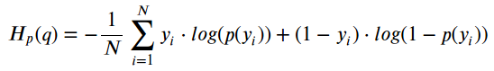

# 07/20/2020 ML DATA 310 Responses

# A
### Problem Statement

#### For my final project I look to explore the area of sports analytics, specifically the National Hockey League (NHL). For anyone who is a hockey fan, the NHL provides you with an ultimate fan experience. An assortmant of entertaining goals, crowd enthusiasm, and of course the only major professional sport that allows fighting. In the project itself, I look to act as a team manager and create the perfect lineup based on certain variables. Some variables include: Goals, Assists, and Save percentage, but some of the more valuable variables will be based on +/- ratings, shot percentage, and 5-on-5 goals for as these are highly regarded on what a good team consists of. In terms of complexity I will need to exploit each players statistics in a way that when combined will make the perfect team and can be simulated in an 82 game season. Some potential roadblocks are expected to happen such as: evaluating the data in a way to extract only what I need and in a timely fashion, creating a simulation where biases are absent from the equation, and plan for the event where my algorithm predicts scores not accurate to what is anticipated.

# C
### Poster design

####

# D
## 1.)
#### The optimizer that was used in this model was 'RMSprop' (Root Mean Square). RMSprop is an unpublished optimization algorithm used for neural networks. The algorithm uses adaptive learning rate methods which have become popular over the past couple years. Really, the centralized idea of using 'RMSprop' is to keep the moving average of each squared gradient for each weight. We then divide the gradient by the square root the mean. In contrast, there is also 'Rprop' which is an algorithm that is used for full-batch optimization. This algorithm is also utilized when trying to combate the problem when gradients vary widely in magnitudes. Rprop combines the idea combines both the sign of the gradient and adapting step sizes individually for each weight.So instead of just looking at the magnitude of a gradient, we can now look at the step size that is specifically designed for each step. But when would we use 'Rprop' or 'RMSprop'? When we are working with large datasets or performing mini-batch weight updates we should use the 'RMSprop' optimizer in comparison to 'Rprop'. 

#### RMSprop:

## 2.)
#### For our selected loss function we used the 'binary-crossentrpy'. Lets take a look at the equation and some classification visuals:

x = [-2.2, -1.4, -0.8, 0.2, 0.4, 0.8, 1.2, 2.2, 2.9, 4.6] 

#### Looking at the equation we can see that the 'y' label and p(y) is the predicted probability of the point being green for all 'N' points. For each green point (y=1), it adds log(p(y)) to the loss, or adds to the log probability of it being green. On the other hand, it adds log(1-p(y)), or adds the log probabilit of it being red, for each red point (y=0). Looking at our points on the line-chart we can see that the green points belong to the positive class which means that 'Yes' they are green, and red points are a part of the negative class 'No' they are not green. If we were to fit a model in order to perform this classification, running it will predict the probability of being green for each point given in the 'x' variable above. Ok, so we know which color is which, but how do we evaluate whether how good or bad the probabilities are? We use the loss function. When using the function, it will return high values for predictions that were below asking price, and low values for predictions more accurate to what we were looking for. 

## 3.)
#### The metric is used to judge the performance of a model. Though similar to the loss functions, the results form evaluating a metric are not used when training a model. There are several available metrics including: Accuracy metrics, Probabilistic metrics, Regression metrics, Classification metrics based on True/False positives & negatives, Image segmentation metrics, and Hinge metrics for 'maximum-margin' classifications.  Using the compile() method, the algorithm takes metric arguments. For this specific method we use metric values that are displayed during the fit() and logged to the History object returned by fit() and model.evaluate(). 

## 4.)

#### When running the model and viewing the plots I notice that they are relatively consistant after approximately 10 epochs. Looking at the first plot, it is normal for the algorithm to be slightly inconsistant near the initial parts of the model then starting near epoch 10-12, the accuracy becomes more correlated between both the training and testing data. Likewise, the second model runs in a negative linear direction and starts out inconsistant in accuracy. Then, near the end of the epochs (10-12) the testing data became more consistant with the training data.

## 5.)
### This is Cat, the model said it was a Cat

### This is a Cat, the model said it was a Dog

### This is a Cat, the model said it was a Dog

### This is a Dog, the model said it was a Dog

### This is a Dog, the model said it was a Cat

### This is a Dog, the model said it was a Dog

#### With the images that I used I found that the model was ~50% accurate. To improve this model's accuracy I believe we could have increased the epoch's level from 15 to 50 or 100 in order to potentially improve my results. Another possiblity is within the Sequential model. We could either increase or decrease the Conv2D layers to 64, 32, or 16. 
