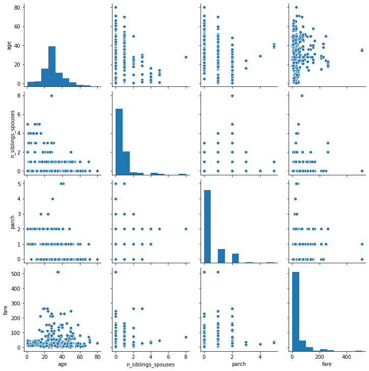
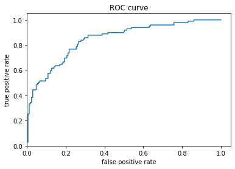
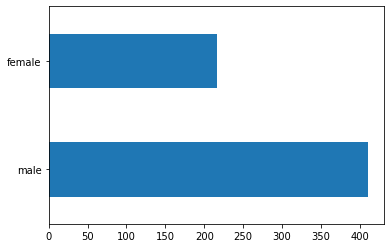
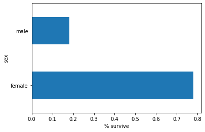
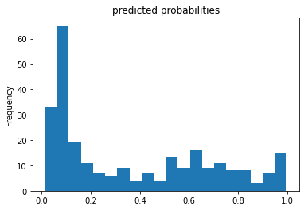
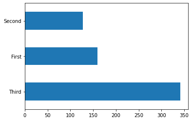

## 07/21/2020 ML DATA 310 Responses

# A

### 1.) How did you split the labels from the training set? What was the name of the labels datasets?
#### In our input function that returns tf.data.Dataset, the output is two-element tuples including features, and labels. Labels in this scenario are arrays containing the values of the label for every example.  During the beginning phases of this model we split out the labels whic hthe model will be training to predict. We used the .pop function to remove the label column from the features. The name of the labels column was 'Species'. 

### 2.) List 5 different estimators from tf.estimator and include the base command as you would write it in a script.

#### - tf.estimator.DNNClassifier()
     
        - classifier = tf.estimator.DNNClassifier(
              feature_columns=my_feature_columns,
              hidden_units=[30, 10],
              n_classes=3)
        
     - tf.estimator.DNNLinearCombinedClassifier()
     
        - tf.estimator.DNNLinearCombinedClassifier(
              model_dir=None, linear_feature_columns=None, linear_optimizer='Ftrl',
              dnn_feature_columns=None, dnn_optimizer='Adagrad', dnn_hidden_units=None,
              dnn_activation_fn=tf.nn.relu, dnn_dropout=None, n_classes=2, weight_column=None,
              label_vocabulary=None, config=None, warm_start_from=None,
              loss_reduction=losses_utils.ReductionV2.SUM_OVER_BATCH_SIZE, batch_norm=False,
              linear_sparse_combiner='sum'
           )
     
     - tf.estimator.LinearClassifier()
     
        - tf.estimator.LinearClassifier(
              feature_columns, model_dir=None, n_classes=2, weight_column=None,
              label_vocabulary=None, optimizer='Ftrl', config=None, warm_start_from=None,
              loss_reduction=losses_utils.ReductionV2.SUM_OVER_BATCH_SIZE,
              sparse_combiner='sum'
            )
        
     - tf.estimator.BoostedTreesClassifier()
     
        - tf.estimator.BoostedTreesClassifier(
              feature_columns, n_batches_per_layer, model_dir=None, n_classes=2,
              weight_column=None, label_vocabulary=None, n_trees=100, max_depth=6,
              learning_rate=0.1, l1_regularization=0.0, l2_regularization=0.0,
              tree_complexity=0.0, min_node_weight=0.0, config=None, center_bias=False,
              pruning_mode='none', quantile_sketch_epsilon=0.01, train_in_memory=False
            )
        
     - tf.estimator.BinaryClassHead()
     
        - tf.estimator.BinaryClassHead(
              weight_column=None, thresholds=None, label_vocabulary=None,
              loss_reduction=losses_utils.ReductionV2.SUM_OVER_BATCH_SIZE, loss_fn=None,
              name=None
            )
            
            
 ### 3.) What is the purpose of input functions and feature columns?
 
 #### An input functions is a function that returns a tensorflow dataset object whose outputs both features and labels. For example, in our premade estimator the input functions incorporates our features: sepal length, sepal width, petal length, and petal width. Feature columns are objects that describe how the model should use raw input data from the features dictionary. By building a list of feature columns, we are able to create a dictionary for our data to sit in  to continue evaluating.
 
 ### 4.) Describe the command classifier.train() in detail. What is the classifier and how did you define it? What nested function are you applying to the training/testing datasets?
 
 #### After we run our data throug the DNN-Classifier, we are then going to train the model. Within the training function itself we see a lambda function which will return the sum of two arguments. Lambda functions can also reference variables from the containing scope. Also in the classifier we see the step function, this tells the method to stop training after a number of training steps.
 
 ### 5.) Redefine your classifier using the DNNLinearCombinedClassifier() as well as the LinearClassifier(). Retrain your model and compare the results using the three different estimators you instatiated. Ranke the three estimators in terms of their performance. 
 
 #### First Place - LinearClassifier() = 0.957
                    "Setosa" (94.8%), expected = "Setosa"
                    "Versicolor" (98.3%), expected = "Versicolor"
                    "Virginica" (94.6%), expected = "Virginica"
 
 #### Second Place - DNNClassifier() = 0.933
                    "Setosa" (84.7%), expected = "Setosa"
                    "Versicolor" (42.5%), expected "Versicolor"
                    "Virginica" (57.3%), expected "Virginica"
  
 #### Third Place - DNNLinearCombinedClassifier() = 0.813
                    "Setosa" (74.3%), expected = "Setosa"
                    "Versicolor" (43.3%), expected = "Versicolor"
                    "Virginica" (59.7%), expected = "Virginica"
                    
# B
                    
# 1.) Build a Linear Model

#### Seaborn Pairplot

#### Age Histogram

#### Titanic Curve

#### Titanic Bar Graph M/F

#### Titanic Bar Graph M/F Survival Percentage

#### Titanic Predicted Probabilities

#### Titanic Class

### What interpretation can you provide of the data based on the histogram and seaborn pair-plot?

#### When looking at both the histogram and pair-plot, I noticed that the range for the y-coordinate was lower by approximately 120 units compared to that of the histogram. I also noticed because of the missing of 120 measuring units that the numbers for our age groups have been deflated to match the new size of the graph. 

### 2.) What is the difference between a categorical column and a dense feature?
#### The categorical column is a sparse column. Sparse columns usually contain a lot of zeros. On the other hand, dense features or dense columns columns have more non-zero entries. 

### 3.) Describe the feature columns that have been input to your LinearClassifier(). How would you assess the result from your initial output? What is the purpose of adding a cross featured column? Did your attempt to capture the interaction between age and gender and incorporate it into your model imporve performance? Include and interpret your predicted probabilities and ROC curve plots.

#### The linear estimator uses both numeric and categorical features. Feature columns work with all Tensorflow estimators and their purpose is to define the features used for modeling. For this classifier we used the age, fare, parch, and n_siblings_spouses. The output was consistant from what I could see but we could also include a different classifier in order to possibly better our predictions such as DNNClassifier(). I found that by combining both age and gender that the predictions were relatively correlated and they moved in a positive direction along the ROC curve until flat-lining around the 0.6 rate. 

