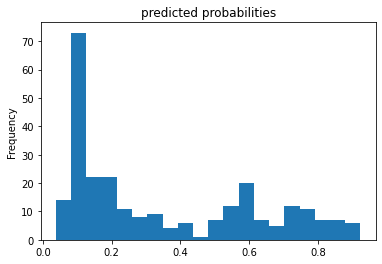
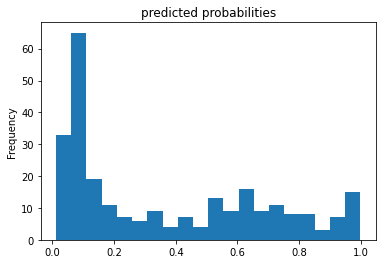
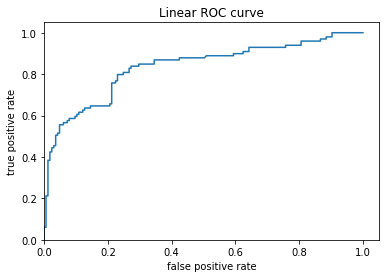
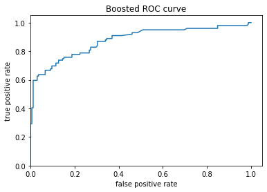
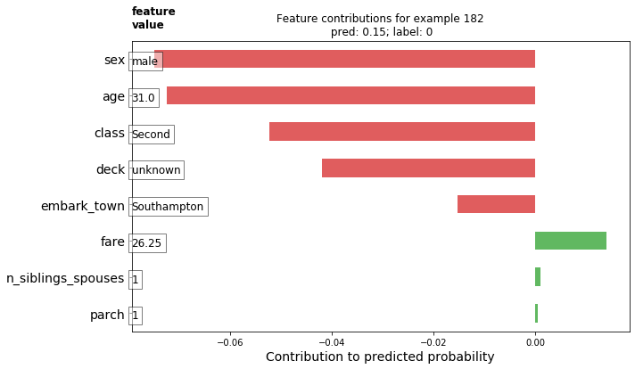
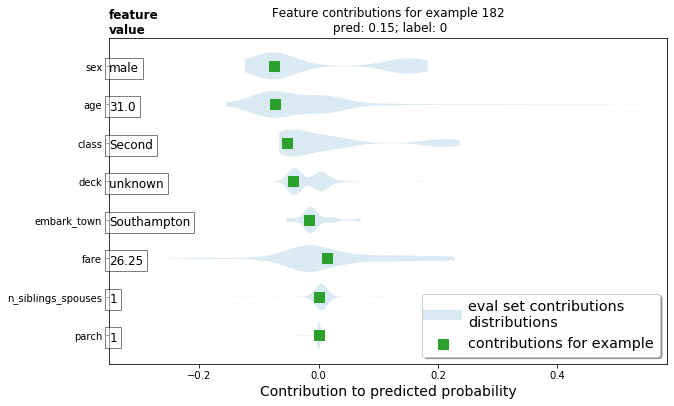
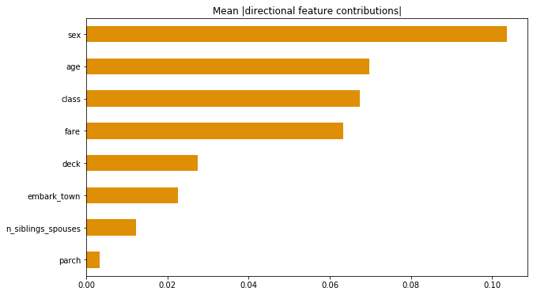
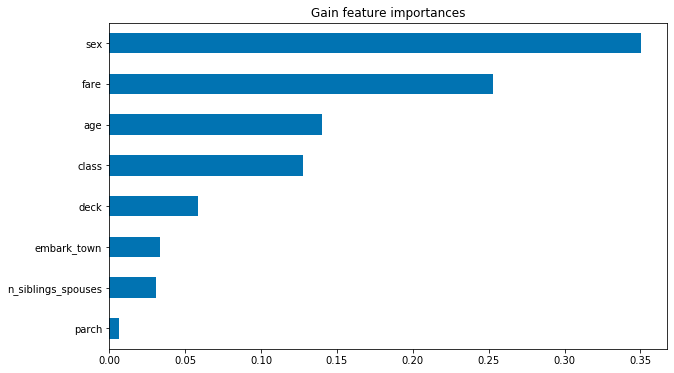

# 07/23/2020 ML DATA 310 Responses

# A 
# Boosted Trees

### 1.) What is a one-hot-encoded column and why might it be needed when transforming a feature? Are you source values continuous or discrete?
#### A one-hot-encoded column is a representation of categorical variables as binary vectors. This requires that the categorical values be mapped to integer values. Then, each integer value is represented as a binary vector that is all zero values except the index fo the integer, which is marked with a 1. Using encoding like this and allowing the model to assume a natural ordering between categories may result in poor performance or unexpected results.  

### 2.) What is a dense feature? How has the content of your data frame been transformed? Why might this be useful?
#### Within the realm of mathematics, dense refers to a mostly non-zero array. Generally, according to the Tensorflow website, a single example in training data is described with FeatureColumns. At the first layer of the model, this column-oriented data should be converted to a single Tensor. The data in our dataframe has essentially been turned into single numbers such as 0 and 1. Using this bineary system, it could possibly give our data more manueverability when trying to manipulate the data or put it in a model. 

### 3.) Provide a histogram of the probabilities for the logistic regression as well as your boosted tree model. How do you interpret the two different models? Are their predictions essentially the same or is there some area where they are noticeably different. Plto the probability density function of the resulting probability predictions from the two models and use them to further illustrate your arugment. Includ eht ROC plot and interpret it with regard to the proportion of true to false positive rates, as well as the area under the ROC curve. How does the measure of the AUC reflect upon the predictive power of your model?
#### Linear Classifier Predicted Probabilities

#### Boosted Trees Predicted Probabilities

#### Linear Classifier ROC

#### Boosted Trees ROC

#### Both models are predicting the same output of survival when the Titanic sinks. The two graph s are relatively the same except for in one spot around the 0.2 frequency range. For the Linear Classifier it was found that a person would have a 0.1 rate of survival 70 percent of the time, whereas for the Boosted Tree model a person would have a 0.1 rate of survival 80 percent of the time. For the ROC plots, the Boosted curve seems to have a smooth curve towards a relatively flat plataeu around the 0.4-0.6 range. On the other hand, the Linear graph does the same around the 0.4-0.6 range and curves up significantly around the 0.2 range. Due to the frequency being equal to 100%, the true positive and false positive are linked to form a curve moving upward.

# B
### 1.) Upload your feature values contribution to predicted probability horizontal bar plot as well as your violin plot. Interpret and discuss the two plots. Which features appear to contribute the most to the predicted probability?

#### Between the two plots the values the same but the layout is quite different. The first, being a bar plot is very standard to what we see most of the time. On the other hand, the violin plot is a method of plotting numeric data with the addition of a rotated kernal density plot on each side. Looking at the plots, we can see that sex, and age contributed to the probability the most compared to variables such as parch, siblings/spouses, and which town a person embarked from. 

### 2.) Upload at least 2 feature importance plots. Which features are the most important in their contribution to your models predictive power?
#### After uploading the two horizontal bar graphs I found that the most important features were 'sex' and 'age' in the 'Mean (directional feature contributions)' while 'sex' and 'fare' were the most important features in the 'Gain Feature Importances' graphical representation. 

