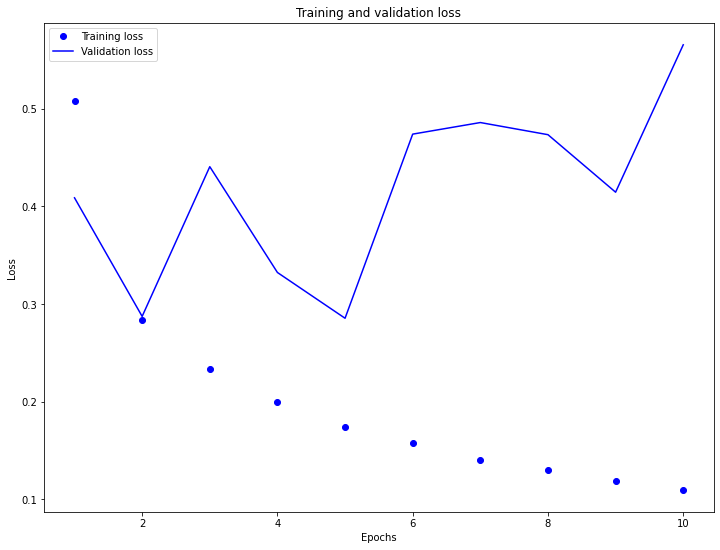
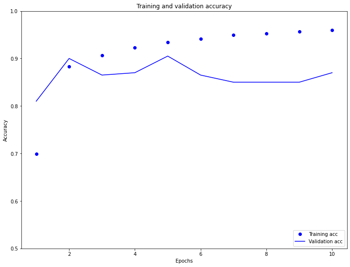
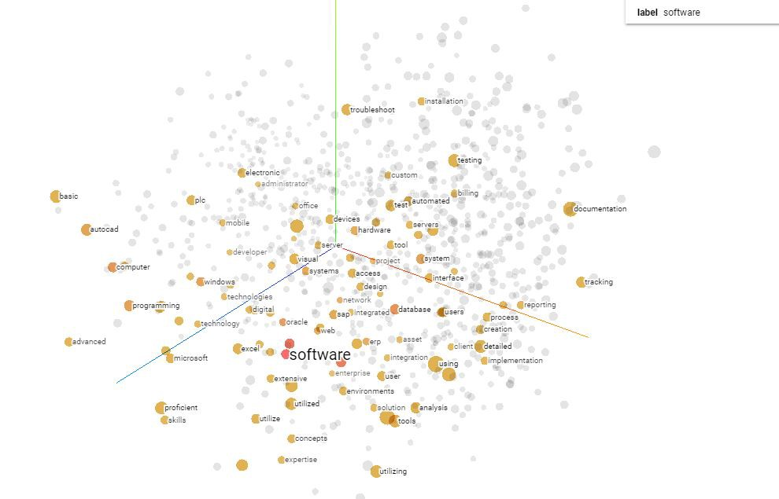
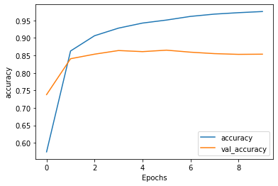
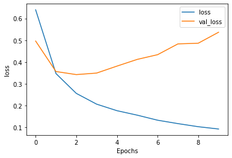

# 07/28/2020 DATA 310 Responses

# Word Embeddings

# C

### 1.) Why is using one-hot encoding inefficient towards vectorizing a corpus of words? How are word embeddings different?
#### A one-hot encoded vector is sparse, which means that most indicies are zero. If there was a vocabulary with a large amount of words and one-hot encoded each word, then we would create a vector where a majority of the elements are zero. Instead we can encode each word with a unique number. With our large vocabulary set we could assign '1' to pest, '2' to test, and '3' to best and be able to encode a sentence with those three words as a dense vector. This is much more efficient than using the one-hot encoding technique. Though more efficient, it also has some downsides such as the integer encoding is arbitrary and an integer-encoding can be challenging for a model to interpret (linear classifier).

### 2.) Compile and train the model from the tensorflow exercies. Plot the training and validation loss as well as accuracy. Post your plots and describe them.
#### In the graphs below, we first notice in the training and validation loss graph that our model is overfitting. We also notice in validation loss that as epochs increase the loss increases by almost 0.2 every every 2 epochs. In the validation accuracy graph you can see that our accuracy is relatively correct and ends between 98.2 and 99.4. You can also see that our validation accuracy line is somewhat inconsistent during our testing. It spikes above .9 at 2 epochs then dips to .85 at 4. Then it moved back above .9 at 5 epochs and dips once again until it hits 10 epochs where it looks to move upward towards our training accuracy dots.  

### 3.) Stretch Goal: Follow the link to the Embedding Projector provided at the end of the exercise. Produce the visualization of your embeddings. Interpret your visualization. What is it describing? Is there relvance with regard to words that are proximate to each other?
#### Using the tensorflow embedding projector was an incredibly interesting tool that is able to locate words within a vocabulary loaded into it. During my time using it, I started by looking for the word 'Education' and the model returned the location of the word within the visualization, nearest neighbors ranging from 5 to 999 depending on what you pick. In particular, my settings were set to 10 neighbors and I recieved back the nearest points: educational, school, schools, institutions, teaching, students, health, universities, welfare, and training. Other tools that are available in the projector are UMAP which is an algorithm for dimension reduction based on manifold learning techniques and ideas from topological data analysis. UMAP alows you to set your number of neighbors and also gives you the ability to choose between a 2D and 3D model. Another tool is T-SNE, which we have used before. T-SNE or t-Distributed Stochastic Neighbor Embedding is a non-linear technique primarily used for data exploration and visualizing high-dimensional data. Using the embedding projector, the t-SNE tool is consistantly making iterations to the model. You can also set your attributes such as perplexity, learning rate, and supervise. The final pre-configured tool is PCA, or Principal Component Analysis. This tool is a dimensionality-reduction method that is often used to reduce the dimensionality of large data sets, by transforming a large set of variables into a smaller one that still contains most of the information in the large set. There are three attributes that are able to be manipulated, 'X', 'Y', and 'Z'. Each of these components, depending on the variance setting, set the points torwards which ever axis  has the most variance you picked. In my case, I chose 'X' = 2.0, 'Y' = 1.0, and 'Z' =  2.5 variances, resulting in a total variance of 5.6%. 

# D

### 1.) Again compile and train the model from the tensorflow exercise. Plot the training and validation loss as well as accuracy. Stack two or more LSTM layers in your model. Post your plots and describe them.

#### In this model, we stacked two LSTM layers. LSTM, or Long short-term memory, is an artificial recurrent neural network (RNN) architecture used in the field of deep learning. LSTM is a type of recurrent neural network capable of learning order dependence in sequence prediction problems. For our LSTM layers we encorporate 64 neurons in the first layer with our return_sequence equal to True, and 32 neurons in our second layer. As you can see in the Accruacy graph that our validation accuracy line (orange) runs relatively smooth accross 0.85 accuracy. In fact, when our model ran, it returned an accuracy of 0.8502. This is slightly less productive than our first model which returned 0.8541. In our loss function from our LSTM, we find that our validation loss grew above 0.5 loss to 0.5385 which is more than our first model which recorded a loss of 0.4469.  
