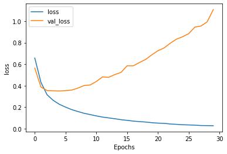
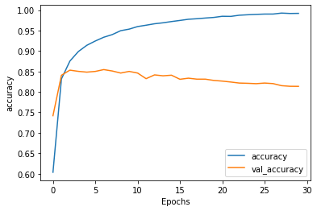

# 07/29/2020 DATA 310 Responses

# II - Responses

### 1.)
#### For the NLP Sarcasm Classifier, I have decided to pick three different sources including Fox News Detroit, BBC, and CNN. Here are the results:

### Fox News Detroit
#### Title: 'Uncle of suspect in beating death of 1-year-old says nephew was not hiding at his home'
#### Result: 0.9963 <- sarcastic

#### Yikes! According to the sarcasm detector this headline from Fox News Detroit is sarcastic. This is actually a true statement and headline.

### BBC
#### Title: 'Tech bosses grilled over claims of 'harmful' power'
#### Result: 0.8235 <- sarcastic

#### Huh? According to the results, the model predicted this to be sarcastic which is obviously not true. Weird!

### CNN
#### Title:'Trump again attempts to stoke racial divisions in housing message'
#### Result: 6.681199e-06 <- not sarcastic

#### Once again, Huh? Out of all three of these news sites, CNN is by far the most controversial in the sense that they like to use titles that spike the most sarcasm, so this output really confuses me. Although it may not seem 100% sarcastic, it sounds so when I say it out loud.

#### Overall this model didn't really work to be honest. I found that it was incredibly overfitting the model (loss: 0.0274/Accuracy: 0.9919/val_loss: 1.1077/val_accuracy: 0.8135) and the title that I had picked to be less sarcastic, if at all, were registered as being sarcastic. Would not recommend to a friend. I think that sarcasm has a lot to do with the tone of voice you use when saying something. For myself, being the sarcastic jerk that I am, use a certain tone of voice that lets people know of when I am just phibbing or actually talking like a regular person. I am sure IBMs Watson can probably tell the truth between what is sarcasm and what isn't, but right now this model does not do what we ask it to do.

# B

### 1.) Use the generate_text() command at the end of the exercise to prodcue synthetic output form your RNN model. Run it a second time and review the output. How has yoru RNN model been able to 'learn' and 'remember' the shakespeare text in order to reproduce a similar output?
#### For this model, I decided to write it 3 times to see how my model learned after each output. Below are the outputs.

## Output 1 <-- 10 epochs

### ROMEO: Sorrow is rumour.
#### They did here Sil Bianca, so occasion wretch:
#### Twenty beauty here rend me in the canstenion of some courage'e!

### ROMEO:
#### I kind milabning shall thine.--honour!

### LUCIO:
#### Let's go not there.

### POGPHERS:
#### So shall the very sea-dief-matter of a woed to frow his victors bas,
#### The law moved and halfuldy bear so well dew,
#### He hath bits dead as you mark thee servise from our father's body, thy day in this,
#### Lay only life by this.
#### Corroward how in gold may; we will thou good to see how owe the
#### which is in the cop of merchantic:
#### Is not all the foe past leason,
#### So many of her sisters! or else
#### 'This absequit is out--to the king!
#### I am now shall her been but it is, I warrant.

### HERMIONE:
#### Do so, in good book! what amies
#### Tybalt his church out condition.

### ISABELLA:
#### Serving it.

### MENENIUS:
#### I envow'd unto you a cause.

### QUEEN MARGARET:
#### Haply as friends at all twelve within.

### BIONDELLO:
#### Here is thine one thing st to thine eyes;
#### In every grave: besides to Baptista: be so much of him;
#### Unless it myself

## Output 2 <-- 30 epochs

### ROMEO: 'Tis giving, hear me bawd.

### ANGELO:

### GLOUCESTER:
#### Nor master or weeping Edward's imprison man:
#### Full dangerous, and want no time to tend thy state;
#### Messenger did not only that thou hast promised me to use me
#### Than take itself none. Come, good father;
#### If that banish'd death.

### LORD FITZWATER:
#### Now teach me how faces that we twelve may I complain?
#### And, for thy pale shall warm his? Gentle Northumberland, Cominius:
#### I do believe it: and then cursed she to my fair,
#### Who had so much grieve me to tell the brother's blood?

### QUEEN ELIZABETH:
#### Though the news with me; for a trubty seize himself,
#### Made peace by this, this living liege.

### JULIET:
#### I'll warrant her; as
#### they are cross'd, past his son, the suggings here that is my love.
#### Shift me to pry into a showledge
#### beg, Norfolk? Thou, art thou as fine I the bran;
#### She comes to Clargnd her kinsman and thy purpose mad with lightnish feal, obey'd
#### With nothing gall; if ever fearful
#### To be unknown love, being the friar tourself,
#### For he is fame to put you to your g

