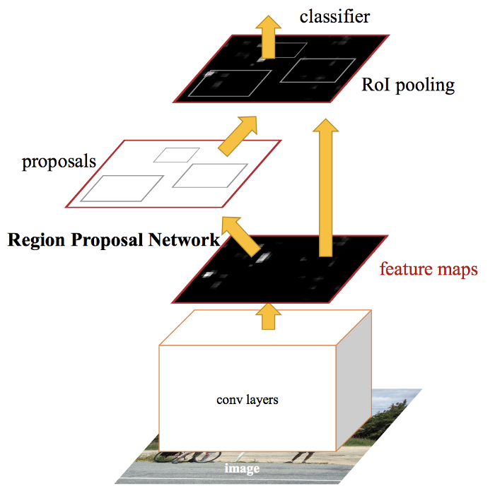
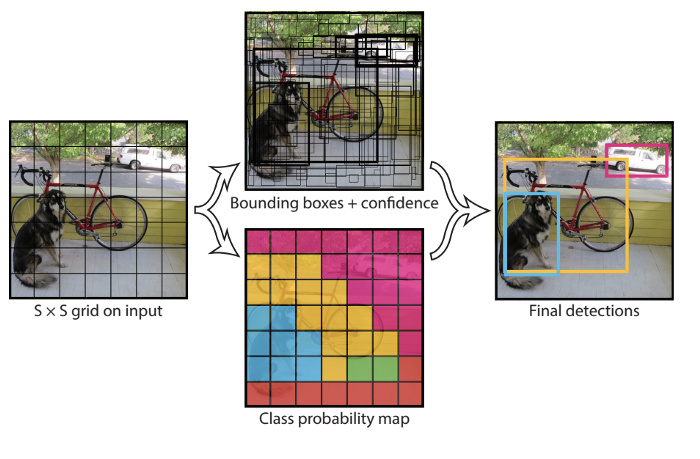
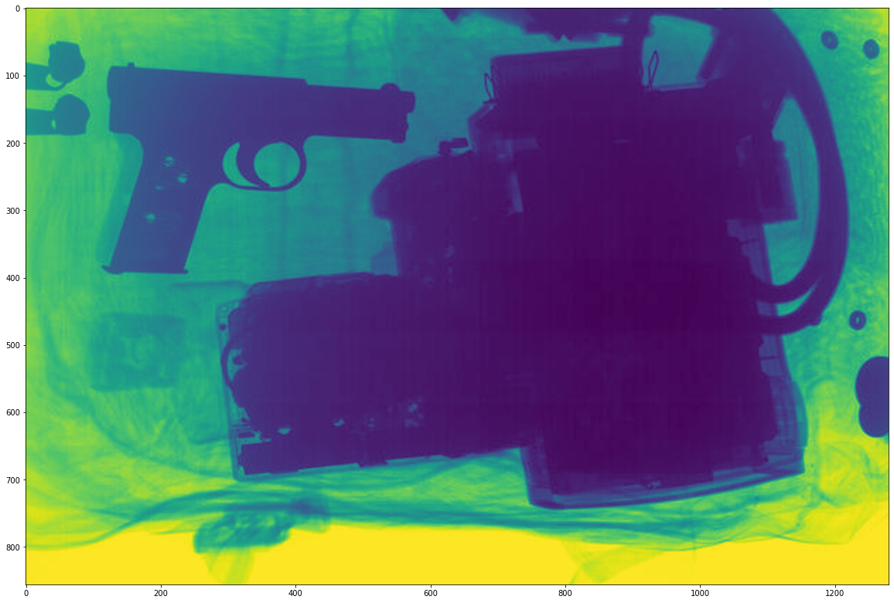
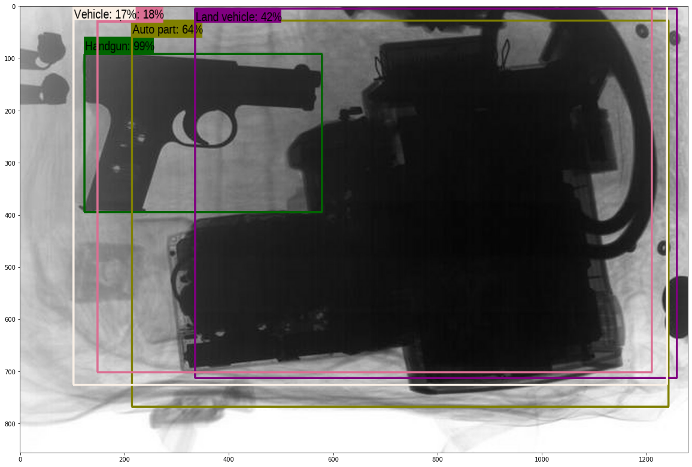
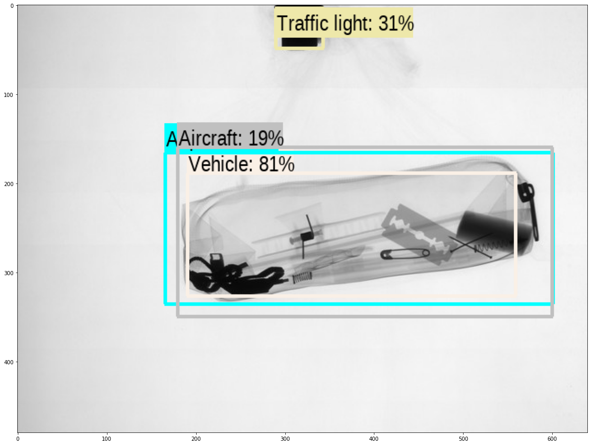
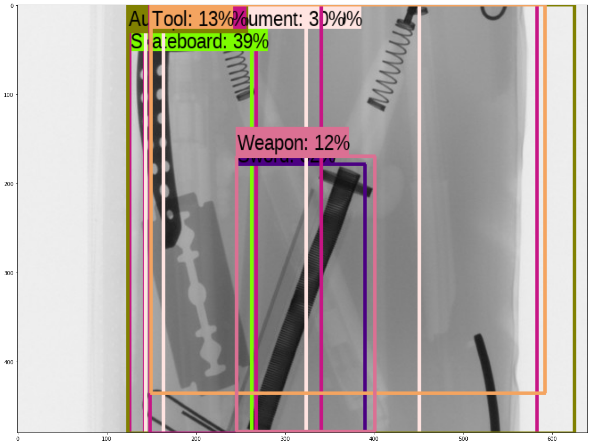
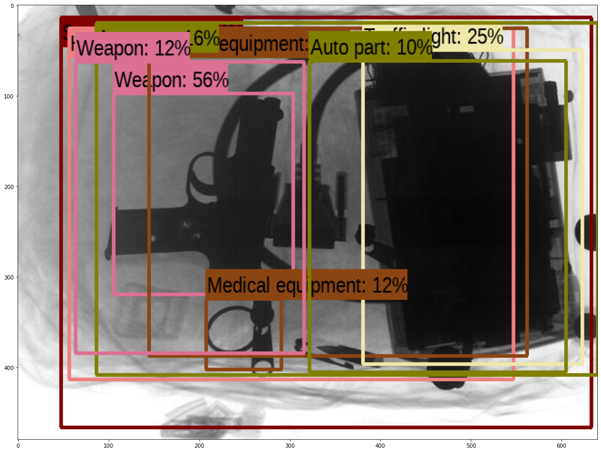

# DATA 310 Final Project
### Paul Brenkus

### Abstract

#### With continued research in machine learning practices, the use of complex supervised feature learning techniques provides a user the ability to solve more intricate problems. Using a supervised learning model, in this scenario, will give the user the ability to accurately identify possible weapons (i.e. handguns, knives) within carry-on luggage or handheld bags during mass transit operations.

### Data Collection

#### In the dataset there are 40 still images of luggage that contain some type of weapon whether it be a gun, knife, or contraband to make a weapon. This data was taken from x-ray still images of security measures that were preformed on individual’s luggage/baggage before getting on a form of mass transit.

### Problem Statement

#### When you put your bags through a scanner before boarding a plane, what is happening? How do they see what is in your bag and how do they know when you have something that isn’t supposed to be there? Or what if they miss the object that isn’t supposed to be there? In this application, I look to take that edge off the everyday passenger who boards a plane, train, or other mass mode of transportation. We pay for the ticket with a sense that we will be safe when transiting from point A to point B. But with a past where objects pass through inspections, without consultation, begs the questions of, how much does the naked eye miss? Using convolution neural networks in real time, I look to add an aid tool to security in mass transit centers in order to better identify weapons. I will be using a dataset containing 40 images of knives, handguns, luggage with contraband, and other assortments of weapons to increase the accuracy of this model. This instrument will be set in real time as bags of different sizes and shapes will be scanned. The model will theoretically display a label and accuracy for which an item in a bag will could be a weapon. For testing purposes, if the model returns an accuracy rate of 25%, the need for further inspection may be needed for that bag.

### Model

#### In this report I will be using a Convolution Neural Network (CNN), particularly a Faster R-CNN or Region-Based Convolution Neural Network. Object detection helps in pose estimation , vehicle detection, and in this case, weapon identification. In this model, we will see that multiple items within a bag will be detected, outlined, and given a percentage of what the algorithm thinks it may be. The Faster R-CNN extinguishes the use of a selective search algorithm  on your feature map to identify the region proposed and is instead ran through a separate network in order to be predicted. By separating these two parts of your model, the output displays faster than your regular R-CNN and Fast R-CNN. The model performs non-maxima suppression inside the algorithm. The maximal number of detection outputted is 100. Detections are outputted for 600 boxable categories.

### Results & Analysis

#### I found that this model created relatively decent results. Given the 40 images, The algorithm was able to detect either a weapon or gun 25.2% of time. It also classified smaller objects such as recoil springs, irregular blades, and smaller contraband as weapons but mislabeled them. I also found that the model misclassified things regularly. For example, there is a detection of there being auto parts, aircraft, and land vehicles. This is false as you cannot sneak a plane through a carry-on bag. Using the Faster R-CNN was the best model I felt that I could use for this, but it can also be tweaked on the number of labels it has per photo, limited detection to certain parameters of objects, and also had a larger dataset to base it’s detection off of to minimize mis-labels or errors. 

### Conclusion

#### In conclusion, I found that this tool can be an excellent aid to security officials for federal and state buildings, mass transit platforms, event venues, and schools. This tool, eventually, can be used in these platforms after some fine tuning. The best option that I could think of to fix this would be to utilize new technology that airports are using in their terminals to detect items. They are starting to introduce Computerized Tomography (CT) scanning devices to give their security personnel the ability to manipulate the scan and visualize more than just a 2D x-ray scan. This tool, coupled with the CT scan, would make for a much safer experience when you are going from point A to point B. Eventually I would like to extend the data set to include more images as well as include a regular CNN in order to better train the images with the testing data. Also, I felt that if I could include a way for the labels to be separated from each other with arrows pointing towards the object, instead of overlapping, I could have read what the model though the object was. Another way to facilitate that would be to have a legend that displayed the different objects that were found and display their accuracies next to their name.

### References

#### Francisco Pérez Hernández y Alberto Castillo Lamas - https://sci2s.ugr.es/weapons-detection
#### Rohith Gandhi - https://towardsdatascience.com/r-cnn-fast-r-cnn-faster-r-cnn-yolo-object-detection-algorithms-36d53571365e
#### Adrian Rosebrock - https://www.pyimagesearch.com/2014/11/17/non-maximum-suppression-object-detection-python/

