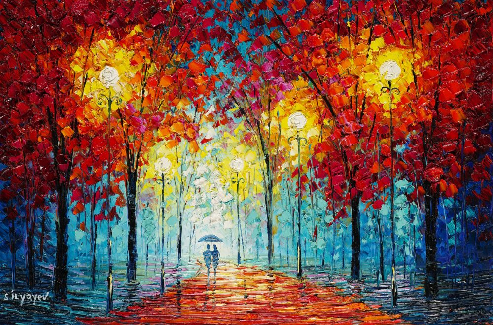
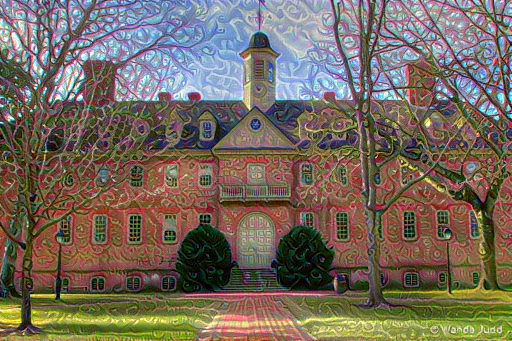
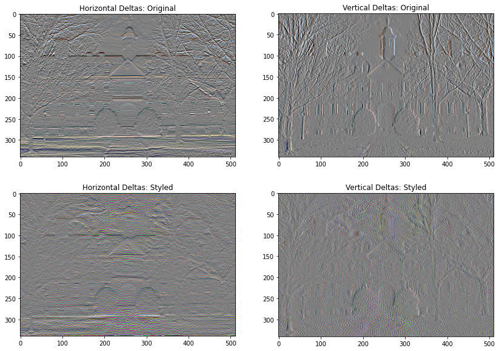
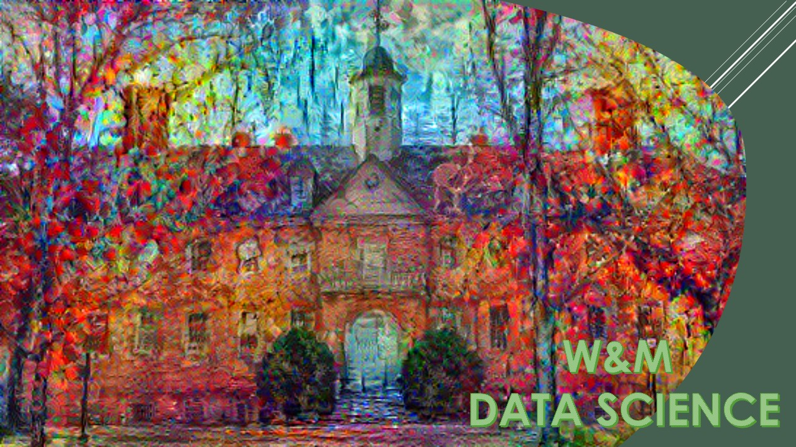

# Jump Start Data Science Program

For the Jump-Start Data Science Program, I wanted to design a photo that encorporated much of what William & Mary, and its community, is about. This year has been one to speak about in some instances, and in many more, to forget. As we were dismissed this past Spring and move into the Fall we as students, faculty, and community are enduring many more obsticals than we had before leaving in March. This photo will hopefully be placed on a shirt for students in this program to wear with pride and be shared with other students and faculty across campus. Hopefully this picture of the Wren can be seen with the beautiful color of Fall as a symbol of change, perserverance, and Tribe. Below is a couple of picture including the original photos, initial optimizations, vertical and horizontal deltas, and the final piece. Enjoy!   

## Originals

## Initial Optimization

## Horizontal and Vertical Deltas

## Final Submission

