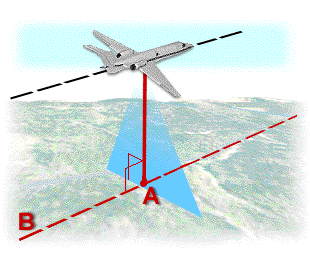
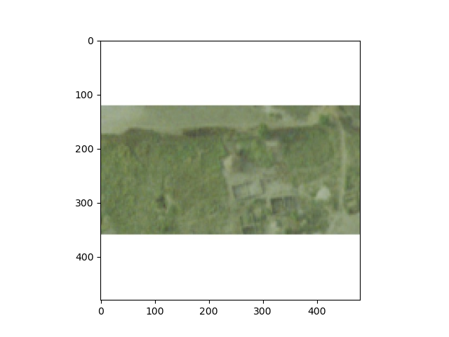
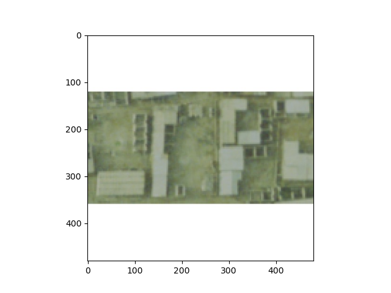
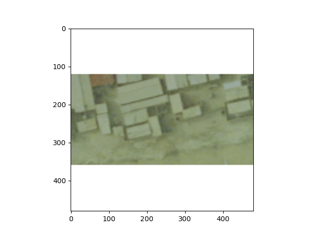

# 07/23/2020 DATA 310 Project 3

# Project 3

### Method Descriptions
####  For this project we were given data consisting of 10000 images of Korle Gonno which is located in Ghana. The target size of these images, or pixels was 480x480. The images were taken from a high resolution camera onboard an aircraft flying overhead so the photos are from a relative 90 degree angle. The particular name for this type of photograph is 'orthophoto' which is an aerial photograph or satellite image which is geometrically correected or 'orthorectified'. In terms of models, I utilized both a Deep Neural Network (DNN) and a Convolution Neural Network (CNN). I started by uploading our image data into two files, one file with 9000 images labeled training data and 1000 images labeled testing data in order to accurately predict our output. The data was then ran through my DNN sequential algorithm which included three Dense layers. The first layer included 128 neurons with 'relu' activated, the second layer included 64 layers with 'relu' also included, and the third included 1 neuron with no activated functions like the other two layers. After being ran through our Sequential model, the data is compiled through our optimizer which is RMSprop. RMSprop, or Root Mean Squared prop, combines the idea of only using the sign of the gradient with the idea of adapting the step size individually for each weight. We then incorporate our metrics which are 'MAE', or Mean Absolute Error, and 'MSE', or Mean Squared Error. The MAE is going to summarize and assess the overall quality of our machine learning model while the MSE will average the squared error in the model that is used as the loss funcction for least squares regression. Once our optimizer is complete, our data is fitted in train images and train labels with a batch size of 100, and steps per epoch of 90. I decided to train my model in steps in terms of epochs. I started with running 10 epochs so that I would not overload my computer. The second test I ran was 20 epochs, and finally I ran the data through 50 epochs. Each test gave within the DNN gave different evaluations which are listed below. For the second test we ran our data through a Convolutional Neural Network or CNN. The CNN takes an image input and then assigns weights and biases to various aspects or objects in the image which helps to differentiate each image from one another by pixel. In our model we have 10 layers consisting of three Conv2D attributes, three MaxPooling2D attributes, one Flatten attribute, and 3 Dense layers. The Conv2D attribute will extend through three channels in an image (Red, Green, and Blue). You can apply different filters in each channel, for this situation I established (16 (3,3)) / (32, (3,3)) / and (64, (3,3)). Each of these Conv2D attributes had 'relu' activated. The MaxPooling2D is attribute is spatial and its function is to progressively reduce the spatial size of the representation to reduce the amount of parameters and computation in the network. Max pooling is done in part to help over-fitting by providing an abstracted form of the representation. In our situation we incorporate three MaxPooling attributes with (2,2) / (2,2) / (2,2) for arguments. After our data has been ran through both Conv2D and MaxPooling, it goes through our Flatten attribute which converts the pooled feature map to a single column that is passed to the fully connected layer. Finally, our data is ran through three dense layers of 128, 64, and 1 neuron respectively. Once our data has gone through our sequential CNN model, the images are then compiled in an RMSprop optimizer, like our DNN model. Unlike the DNN model, I only ran one test on this in order to save time with the results listed below. The last part of this algorithm takes an input that I put in for an individual photo that determines what the population density is within that specific photo. 

# DNN
#### Test 1: Epochs = 10 / MAE = 49.6016 / MSE = 3810.4182
#### Test 2: Epochs = 20 / MAE = 35.5105 / MSE = 1591.2828
#### Test 3: Epochs = 50 / MAE = 35.4111 / MSE = 1584.3584

# CNN
#### Test 1: Epochs = 5 / MAE = 36.1135 / MSE = 1865.8622

### Conclusion
#### I found that this algorithm ran relatively smoothly through the entire process but did take more time than our other project we have ran. This could be in part to the data set that we used and the algorithm having to decipher each individual photo and the pixels within it. The next issue would be with computing power. My idea set up would be a Intel Core I7 with a higher GPU power rating and with at least 64 gb of RAM. It is always good to have at least a 1TB SSD. Unfortunately I am not rich. In terms of the prediction of each image that I input, I found that this algorithm did not predict very well, as you can see in the following three photos.

Image: 1800
Model Prediction: 0.52835184

Real Value: 20.84693145195

Image: 2800
Model Prediction: 0.60993063

Real Value: 22.8351249694824

Image: 3800
Model Prediction: 0.6537024

Real Value: 25.971288610303

# Ending Remarks

#### As you can see from these predictions they are not very accurate. I found that there are some issues that we can point our attention to including how building that are classified as buildings in the photos may not actually contain individuals but could be offices, sheds, or even supply depots. Because the photos are from a 90 degree angle, the algorithm may be unable to detect what the difference between an apartment building or home and a building that does not contain people. I way that we could possibly counteract this is by using another data set that contained addresses or some type of GPS to differentiate between a home or living doscile and an ordinary building. 

